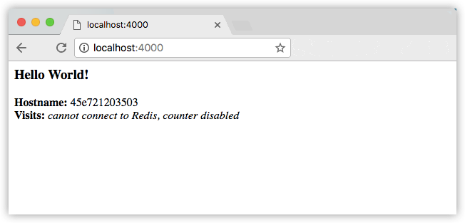

# 第三部分：服务

## 先决条件
- 安装v1.13或更高版本的Docker
- 安装Docker Compose。如果是Docker for Mac或者Docker for Windows，它是被预安装好的。在Linux系统上，你需要直接安装它。在没有Hyper-V的Windows 10系统上，需要使用Docker Toolbox。
- 阅读第一部分的概况介绍。
- 学习第二部分的如何创建容器。
- 确保你已经将friendlyhello镜像发布到了registry上，我们将用它做分享镜像。
- 确保你的镜像运行后是一个部署完好的容器。执行这条命令，填入你的`username`、`repo`和`tag`：`docker run -p 80:80 username/repo:tag`,然后访问`http://localhost/`。

## 介绍
在第三部分，我们将伸缩我们的应用并且启用负载均衡。为了完成这些，我们首先要提高我们在一个分布式应用中的层次：服务。

- 栈
- **服务**（你在这儿）
- 容器（在第二部分中涉及）

## 关于服务
在分布式应用中，不同的app叫作“服务”。例如，一个视频分享网站，它可能有一个服务用于将应用数据存储到数据库中、一个服务用于在后台对用户上传的视频进行转码、一个前台服务等等。

服务即是“生产中的容器”。一个服务只运行一个镜像，但它约定了镜像应该使用哪个端口，需要运行多少个容器的副本以便服务拥有它需要的负载能力以及其他等设置。伸缩一个服务意味着改变运行着软件的容器实例的数量，在进程中分配更多的计算资源给服务。

幸运的是，通过Docker定义、运行、伸缩服务十分简单 - 只需要写一个```docker-compose.yml```文件即可。

## 你的第一个```docker-compose.yml```文件

```docker-compose.yml```文件是一个定义了Docker容器在生产中的行为的YAML格式文件。

### ```docker-compose.yml```

将文件保存为```docker-compose.yml```，保存位置任选。请确保你已经上传了你在第二部分中创建的镜像到registry中，然后将```.yml```文件中```username/repo:tag```位置修改为你自己的镜像的相关信息。

```yaml
version: "3"
services:
  web:
    # replace username/repo:tag with your name and image details
    image: username/repository:tag
    deploy:
      replicas: 5
      resources:
        limits:
          cpus: "0.1"
          memory: 50M
      restart_policy:
        condition: on-failure
    ports:
      - "80:80"
    networks:
      - webnet
networks:
  webnet:
```

这个```docker-compose.yml```指名Docker需要完成以下事情：

- 从registry中拉去在第二步中上传的镜像
- 运行五个镜像的实例，指定服务名称为web，限制每一个实例最多使用10%的CPU和50MB的内存。
- 当容器停止运行时，立即重启它。
- 映射主机的80端口到web服务的80端口。
- 规定web的容器经由一个叫做webnet的负载均衡网络来共享80端口
- 指定webnet使用默认配置（负载均衡覆盖网络）
- 

> 想多了解Compose文件中的versions、names和commands ？
> 
> 注意，我们将Compose文件的version设置为“3”。这实质上是让它适配为[集群模式](https://docs.docker.com/engine/swarm/)。我们可以使用[deploy](https://docs.docker.com/compose/compose-file/#deploy)字段（仅在[3.x或以上版本的Compose文件](https://docs.docker.com/compose/compose-file/)中生效）和它的子选项实现负载均衡和优化每个服务的性能（例如：```web```）。我们可以通过```docker stack deploy```命令来运行Compose文件（同样仅适用于3.x或以上版本）。你也可以使用```docker-compose up```命令来运行版本3.x的文件为无集群配置。但我们现在正演示如何构建集群，所以我们只谈栈的部署。
> 
> 你可以命名Compose文件为任意有意义的名字；```docker-compose.yml```是一个标准的名称。我们可以把这个文件叫做```docker-stack.yml```或是其他的任意名字。

## 运行你的负载均衡应用

在我们执行```docker stack deploy```命令前，我们首先要执行：

```docker swarm init```

> 注意：我们将在第四部分了解这个命令的含义。如果你不执行```docker swarm init```命令便执行```docker stack deploy```，它会抛出一个错误“this node is not a swarm manager”。

现在让我们执行它。你可以赋予你的应用一个名称，这里我们将它设为```getstartedlab ```:

```
docker stack deploy -c docker-compose.yml getstartedlab
```
现在，在我们的主机上，我们的单个服务栈就运行了5个我们部署的镜像的的容器实例。让我们深入了解一下。

获取应用中的服务的ID:

```docker service ls```

你将会看到前缀为应用名的web服务的ID的输出。如果你和上例中采用了同样的命名，那么web服务的名字将会是```getstartedlab_web```。服务的ID将会和副本数量、镜像名称和暴露的端口一同被列出来。

Docker集群会运行生成容器的任务。任务有其自己的状态和ID。让我们列出所有任务：

```docker service ps <service>```

> 注意：Docker对集群的支持源自一个名为SwarmKit的项目。SwarmKit任务不需要成为容器，Docker集群任务会生成它们。

让我们检查任务其中之一，然后用容器ID做参数限制：

```
docker inspect --format='{{.Status.ContainerStatus.ContainerID}}' <task>
```
反之亦然，你可以检视一个容器的ID，然后获取任务的ID。

首先执行```docker container ls```来获取容器的ID,然后：

```
docker inspect --format="{{index .Config.Labels \"com.docker.swarm.task.id\"}}" <container>
```
现在列出所有的5个容器：

```
docker container ls -q
```
你可以连续运行```curl http://localhost```几次，或者在你的浏览器上访问这个URL然后刷新几次。
 
你会看到容器ID改变，证明负载均衡生效。对于每个请求，负载均衡器会循环地选中五个副本中的其中之一，然后再响应。容器ID会匹配你在之前的命令中看到的输出(```docker container ls -q```)。

> 注意：在这个阶段，容器对HTTP请求的响应时间可能会达到30秒。这不是因为Docker的设置或是集群的性能问题，而是Redis依赖未配置的问题。我们会在后面的教程中解决。

## 伸缩应用
你通过设置在```docker-compose.yml```中的replicas字段的值可以伸缩应用，保存修改，然后重新执行```docker stack deploy```命令：

```
docker stack deploy -c docker-compose.yml getstartedlab
```
Docker会直接更新这个配置，而不用先关掉栈或是停止任何容器。

现在重新执行```docker container ls -q```命令可以看到重新配置后部署的镜像。如果你增加了副本数，你会看到启动了更多的任务和容器。

## 停止应用和集群
通过命令```docker stack rm```来停止应用：

```docker stack rm getstartedlab ```
这会移除应用，但集群的一个节点仍在启用(你可以通过```docker node ls```看到)。通过``` docker swarm leave --force```命令来停用集群。

通过Docker你可以很轻松地启用和伸缩你的应用。现在你在如何在生产上运行容器已经迈出了巨大的一步。在此之上，你将学习如何在Docker机器集群上，将你的应用作为一个真正的集群来运行。
> 注意：像这样的Compose文件用来定义Docker应用，它可以上传到使用Docker Cloud的云服务提供商、任何硬件或是Docker Enterprise Edition中的云服务提供商。

## 备忘单
下面是这个页面中提及的Docker命令：

```
docker stack ls                                            # List stacks or apps
docker stack deploy -c <composefile> <appname>  # Run the specified Compose file
docker service ls                 # List running services associated with an app
docker service ps <service>                  # List tasks associated with an app
docker inspect <task or container>                   # Inspect task or container
docker container ls -q                                      # List container IDs
docker stack rm <appname>                             # Tear down an application
```